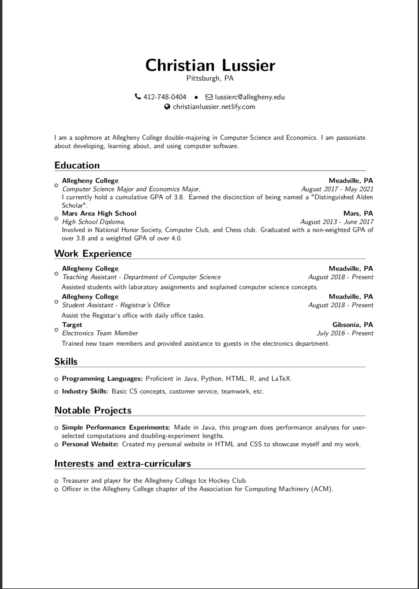

# lussiercLaTeXResume
This repository holds the files related to my résumé which was coded in LaTeX.

## Important Files
- `Resume.tex` holds the code for my résumé.
- `Resume.pdf` is the actual résumé, in PDF form.

## Overview

## Template
I used a fantastic template by Anurag Gupta to create this LaTeX resume which can be found [here](https://www.overleaf.com/articles/anurags-resume/jdfqhmhqzbxv).

## Usage
Feel free to use this résumé as a template for your own, but be sure to change all of the information on it. To acquire it, download the files or clone it.
