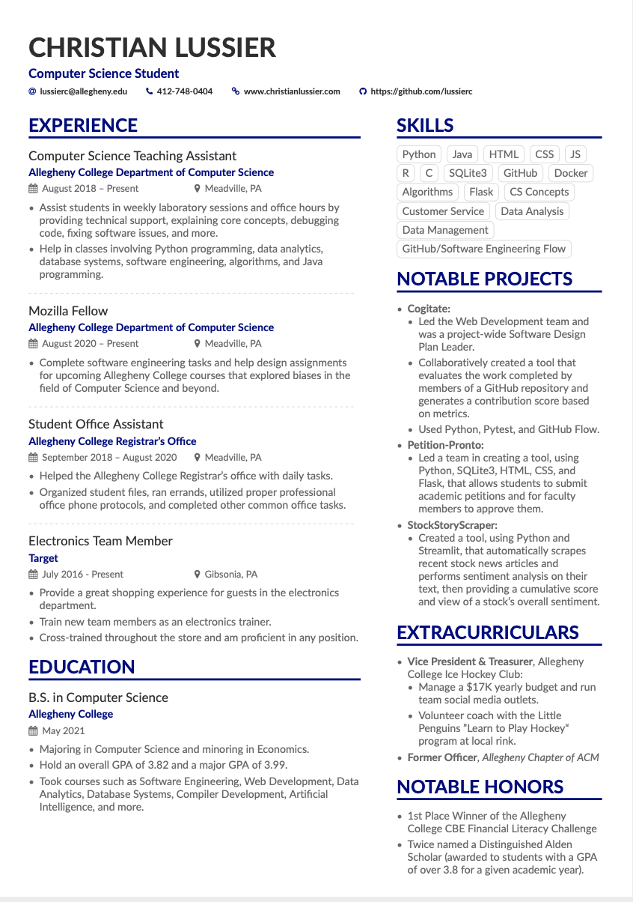

# lussiercLaTeXResume
This repository holds the files related to my resume which was coded in LaTeX.

## Important Files
- `Resume.tex` holds the code for my resume.
- `Resume.pdf` is the actual resume, in PDF form.

## Overview

## Please Note
I have removed my phone number from this open-source version of my resume for privacy reasons. If you need to get in contact with me please email me or message & we can go from there.

## Usage
Feel free to use this resume as a template for your own, but be sure to change all of the information on it. To acquire it, download the files or clone it.
